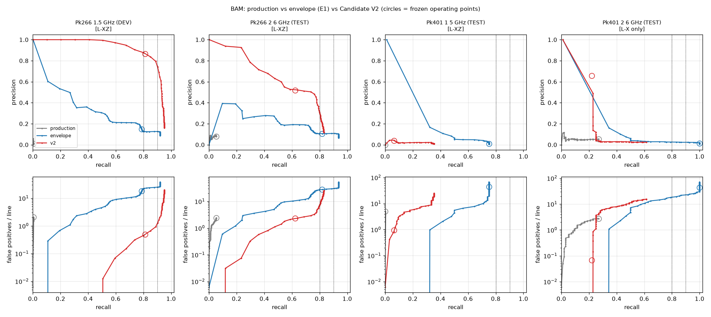

# Candidate generation V2: a deterministic, physically informed candidate generator on BAM

**Date:** 2026-10-05 · **Branch:** `research/candidate-generation-v2` (from `research/yesan-kec-testbed-ground-truth`) · **Status:** EXPERIMENTAL (`benchmark.gates.CAPABILITY_STATUS["candidate_generation_v2"]`). The production detector is unchanged, and there is no ML and no AI classifier.

## Summary

| | |
|---|---|
| Is V2 clearly better than production? | **No, not overall.** It is clearly better on the duct target class, with held-out depth-checked recall 0.62 vs 0.05 at the same FP rate. It is not better on foam cuboids or on the empty control. |
| FP/line at 80% recall (held out) | **7.9** on Pk266 2.6 GHz (envelope 27.8; production cannot reach it). Unreachable on both Pk401 scans. |
| FP/line at 90% recall (held out) | **Unreachable** on every held-out scan (V2 max recall 0.83 / 0.35 / 0.61). |
| Removes the most FPs | Among hard filters, **the hyperbola shape test**. Among score terms, **background contrast**. Conditioning is the single largest stage, but it is a prerequisite rather than a filter. |
| Causes the most missed targets | **The hyperbola shape test**, both as a filter and as a score term. |
| Small enough for an AI classifier? | **By size, yes** (0.2–4.9 candidates/line, 5–24 clusters/scan). **By recall, no:** a classifier can only remove candidates, and V2 caps held-out recall at 0.35–0.83. |
| Recommendation | **Remain experimental.** Do not replace production. Do not abandon. |



*Top: precision–recall. Bottom: false positives per line vs recall (log). Circles mark the frozen operating points. Dotted lines mark 80% and 90% recall. Pk401 2.6 GHz uses L-X only (see §2).*

## 1. What V2 is

The code is in `benchmark/candidate_v2.py`. It is truth-blind and deterministic, and every term is listed in the module docstring.

| Stage | What it does | Physical rationale |
|---|---|---|
| 0 Conditioning | Dewow (2 ns running mean), horizontal running-median background removal over W traces, Hilbert envelope, robust per-line z | Removes laterally continuous energy: direct wave, back wall, flat layers |
| 1 Proposals | Envelope local maxima above an adaptive (robust-z) threshold; ridge tracked across traces (lateral extent) | A real scatterer is wider than one trace |
| 2 Shape | Envelope stacked along `t = t_s + sqrt(τ0² + (2Δx/v)²)` for v ∈ 0.08–0.16 m/ns. Sub-scores: fit, curvature vs a flat line, symmetry, continuity, apex stability. Dominant frequency vs the scan median | Point and cylinder scatterers give diffraction hyperbolas, while layers and steps give flat events |
| 3 Persistence | Fraction of ±6 neighbouring lines with a proposal within 10 mm / 0.1 ns | Objects are continuous across lines |
| 4 NMS + clustering | Per-line NMS on the final score (100 mm × 0.5 ns, the same as E1); union-find across lines | One candidate per response |

**Component scores** are all in [0, 1]: `signal_strength`, `background_contrast`, `shape_score`, `persistence_score`, `noise_penalty` and `direct_wave_penalty`.

- `final_score` is the mean of the first four, minus 0.25 × each penalty. The weights were fixed before any evaluation.
- The **hard filters** are:
  - `F_lateral`: extent ≥ 60 mm;
  - `F_shape`: shape ≥ 0.2;
  - `F_persistence`: persistence ≥ 0, so it is effectively off (see §5);
  - `F_penalties`: direct-wave ≤ 0.5 and noise ≤ 0.8.
- The **blind inputs** are the scan's own direct-wave time and its median dominant frequency. No target, manifest or calibration is read (`tests/test_candidate_v2.py`).

## 2. Evaluation discipline

| | Scans (all Rot00) | Use |
|---|---|---|
| Development | Pk266 1.5 GHz | The only scan used for any choice: tuning grid, persistence tolerance and operating threshold |
| Test (held out) | Pk266 2.6 GHz, Pk401 1.5 GHz, Pk401 2.6 GHz | Frozen parameters only; never looked at while tuning |
| Control | Pk050 1.5 / 2.6 GHz (no targets) | Every detection is a false positive |

- **Same split as E1.** The envelope baseline's parameters (W=81, global, T=10) were frozen on the same development scan in the earlier experiment, so all three arms share one discipline.
- **V2 tuning grid** (96 configurations, `scripts/bam_candidate_v2_experiment.py`): W ∈ {41, 81}, proposal threshold ∈ {4, 6}, lateral extent ∈ {20, 60} mm, shape_min ∈ {0, 0.1, 0.2, 0.3}, persistence_min ∈ {0, 0.2, 0.4}.
- **Selection criterion:** minimum FP/line at depth-checked recall ≥ 0.80 on development.
- **Frozen values:** W = 81, threshold 6, extent 60 mm, shape_min 0.2, persistence_min 0. The operating threshold is final_score ≥ 0.768, the highest that reaches 0.80 recall on development.
- **Matching** is the pre-registered L-XZ rule, identical to `benchmark.scoring.score_localization`:
  - for each (line, target), the highest-ranked detection within |dx| ≤ 100 mm must lie within 60 mm of the drawn top depth under the same scan's back-wall calibration;
  - other in-depth window entries count as duplicates;
  - everything else is a false positive.
- **Pk401 2.6 GHz and Pk050 2.6 GHz:** calibration was refused, so depth is not scoreable and only L-X (horizontal) is reported, labelled as such. **L-X is more permissive than L-XZ**, so do not compare those numbers with the L-XZ ones.
- **"FP/line at X% recall"** is read off each test scan's own curve. It characterises the curve and is **not** a frozen result. The frozen results are the operating points (circles).

## 3. Results at the frozen operating points

Recall and precision use L-XZ unless marked. "dup" is the share of in-depth matches that are duplicates.

| Scan | Arm | Recall | Precision | F1 | FP/line | dup | Detections | Max recall on curve |
|---|---|---|---|---|---|---|---|---|
| **Pk266 1.5 (DEV)** | production | 0.005 | 0.009 | 0.006 | 2.04 | 0.25 | 333 | 0.005 |
| | envelope | 0.786 | 0.148 | 0.249 | 18.1 | 0.05 | 3444 | 0.92 |
| | V2 | 0.811 | 0.867 | 0.838 | 0.50 | 0.00 | 602 | 0.95 |
| **Pk266 2.6 (TEST)** | production | 0.053 | 0.080 | 0.064 | 2.43 | 0.11 | 430 | 0.053 |
| | envelope | **0.818** | 0.106 | 0.187 | 27.8 | 0.06 | 5027 | 0.94 |
| | V2 | 0.623 | **0.518** | **0.566** | **2.32** | 0.05 | 794 | 0.83 |
| **Pk401 1.5 (TEST)** | production | 0.000 | 0.000 | 0.000 | 5.03 | – | 810 | 0.00 |
| | envelope | **0.750** | 0.010 | 0.020 | 44.8 | 0.38 | 7326 | 0.75 |
| | V2 | 0.063 | **0.037** | **0.047** | **0.96** | 0.00 | 161 | 0.35 |
| **Pk401 2.6 (TEST, L-X only)** | production | 0.271 | 0.055 | 0.092 | 2.77 | 0.13 | 476 | 0.27 |
| | envelope | **1.000** | 0.013 | 0.027 | 43.8 | 0.79 | 7520 | 1.00 |
| | V2 | 0.219 | **0.656** | **0.328** | **0.07** | 0.00 | 32 | 0.61 |
| **Pk050 1.5 (CONTROL)** | production | – | – | – | **2.79** | – | 449 | – |
| | envelope | – | – | – | 18.0 | – | 2895 | – |
| | V2 | – | – | – | 3.02 | – | 487 | – |
| **Pk050 2.6 (CONTROL, L-X)** | production | – | – | – | **1.70** | – | 274 | – |
| | envelope | – | – | – | 21.6 | – | 3480 | – |
| | V2 | – | – | – | 2.83 | – | 455 | – |

### Error of the matched detections

These errors are conditional on a match, so they are bounded by the ±100 mm and ±60 mm windows.

| Scan | Arm | Mean \|dx\| mm | Depth error mean (signed) / RMS mm |
|---|---|---|---|
| Pk266 2.6 | production | 46.8 (n=34) | −58.5 / 58.5 |
| Pk266 2.6 | envelope | 9.8 (n=527) | +4.6 / 6.0 |
| Pk266 2.6 | V2 | 9.4 (n=401) | +5.1 / 5.7 |
| Pk401 1.5 | envelope | 6.3 (n=72) | +26.6 / 26.8 |
| Pk401 1.5 | V2 | 4.2 (n=6) | +29.4 / 29.5 |
| Pk401 2.6 | V2 | 1.9 (n=21) | not scoreable |

- On the ducts, V2 and the envelope localise equally well: about 10 mm horizontally (grid 5 mm) and about +5 mm in depth. V2 does not localise better; it **ranks** better.
- On the foam cuboids, both envelope methods pick a response about 29 mm **below** the drawn top. This is a consistent bias, not noise. It is near the 30 mm top-to-centre offset, so the strongest envelope may sit near the block centre or base rather than its top. That is unexplained and recorded, not corrected.

### Duplicates and FP character

- **Duplicates** are small for V2 (0–5%) because of the final NMS. They are large for the envelope on Pk401 (38–79%).
- **V2's residual false positives** (L-X categories in `evidence/bam/results/candidate_v2.json`):
  - on test, mostly **step-edge** diffractions and **back-wall-band** energy;
  - on the controls, back-wall band, below-back-wall multiples, the edge-reinforcement zone and (Pk050 2.6) "unexplained". Pk050 carries M16 impact anchors that are not in the target list, so some "unexplained" responses may be real.
- Step edges are genuine diffractors, so a hyperbola test **cannot** reject them by construction.

## 4. Ablations

### 4a. Hard filters, at the frozen threshold

| Variant | Pk266 2.6 R / FP/line | FP/line @80% (Pk266 2.6) | Pk401 1.5 R | Pk401 2.6 R (L-X) | Pk050 1.5 FP/line |
|---|---|---|---|---|---|
| frozen V2 | 0.623 / 2.32 | 7.91 | 0.063 | 0.219 | 3.02 |
| without F_lateral | 0.620 / 2.45 | 9.64 | 0.052 | 0.240 | 3.02 |
| without F_shape | 0.623 / 2.32 | 11.08 | 0.063 | 0.219 | 3.03 |
| without F_persistence | identical (filter was already off) | 7.91 | | | |
| without F_penalties | 0.623 / 2.32 | 7.87 | 0.063 | 0.219 | 3.02 |
| without all filters | 0.620 / 2.45 | 13.53 | 0.052 | 0.240 | 3.03 |
| **without conditioning** | **0.033 / 1.01** | unreachable | 0.000 | 0.000 | 0.02 |

At the frozen threshold the hard filters change little, because the same evidence already enters `final_score`. They matter lower down the curve: FP/line at 80% recall rises from 7.9 to 13.5 with every filter off, and to 11.1 without F_shape. Without conditioning (background removal) there are essentially no detections and no recall.

### 4b. Proposals each filter rejects

The table shows what each filter rejects, and what it rejects alone (as the **sole** rejector), split by whether the proposal is target-consistent (inside a target window and, where scoreable, at the right depth). Columns are held-out Pk266 2.6 / Pk401 1.5 / Pk401 2.6 (L-X), then the two controls.

| Filter | Rejected | Sole rejector | Sole rejector of target-consistent proposals |
|---|---|---|---|
| F_shape | 15 897 / 44 178 / 50 662; controls 14 148 / 19 789 | 10 336 / 17 186 / 18 118; controls 7 060 / 10 173 | **810** / **224** / **950** |
| F_lateral | 8 032 / 35 748 / 35 265 | 2 943 / 4 415 / 4 541 | 98 / 188 / 365 |
| F_penalties | 3 138 / 24 795 / 15 721 | 764 / 2 141 / 2 985 | 33 / 158 / 255 |
| F_persistence | 0 (off) | 0 | 0 |

### 4c. Score terms

Each term is removed, the operating threshold is **re-frozen on development**, and the result is applied to test (`evidence/bam/results/candidate_v2_component_ablation.json`).

| Removed term | Pk266 2.6 R / P / FP/line | @80% | max R | Pk401 1.5 R | Pk401 2.6 R / FP/line | Pk050 1.5 / 2.6 FP/line |
|---|---|---|---|---|---|---|
| none (frozen V2) | 0.623 / 0.518 / 2.32 | 7.91 | 0.83 | 0.063 | 0.219 / 0.07 | 3.02 / 2.83 |
| signal_strength | 0.648 / 0.474 / 2.87 | – | 0.75 | 0.010 | 0.229 / 0.16 | 3.14 / 2.66 |
| **background_contrast** | 0.665 / **0.279 / 6.88** | – | 0.74 | 0.083 | 0.250 / **0.83** | **4.85 / 4.91** |
| **shape_score** | **0.769 / 0.687 / 1.40** | **1.96** | **0.96** | 0.156 | 0.198 / 0.24 | 4.12 / 4.07 |
| persistence_score | 0.592 / 0.422 / 3.25 | – | 0.77 | 0.031 | 0.240 / 0.37 | 4.62 / 4.22 |
| noise_penalty | 0.672 / 0.487 / 2.83 | 10.36 | 0.82 | 0.073 | 0.229 / 0.19 | 4.04 / 3.42 |
| direct_wave_penalty | 0.696 / 0.610 / 1.78 | 2.39 | 0.92 | 0.052 | 0.219 / 0.06 | 2.71 / 2.55 |

- **Background contrast** removes the most false positives. Dropping it triples FP/line on held-out Pk266 2.6 and raises both controls by about 60–75%.
- **The shape term costs the most recall.** Without it, held-out Pk266 2.6 improves on every axis: recall 0.77, precision 0.69, FP/line @80% 1.96, max recall 0.96. However, the empty control gets **worse**: 4.1 vs 3.0 FP/line.
- Removing the **direct-wave penalty** also helps held-out Pk266 2.6 and both controls slightly.
- Both of these are **findings, not a new configuration.** They come from test scans, so adopting them now would be tuning on the reported test set. Any variant built on them must be frozen and evaluated on scans not used here (§7).

## 5. The seven questions

**1. Is V2 clearly better than production?**
**No, not overall; yes on ducts.**
- Held-out Pk266 2.6 GHz: depth-checked recall 0.62 vs 0.05 and precision 0.52 vs 0.08, at the same FP rate (2.3 vs 2.4/line).
- Foam cuboids:
  - Pk401 1.5 GHz: recall 0.06 vs 0.00. Neither arm is usable.
  - Pk401 2.6 GHz: under L-X, V2's recall is *lower* than production's (0.22 vs 0.27), although at 40× fewer false positives (0.07 vs 2.77/line).
- Empty control: V2 produces *more* false positives than production (3.0 vs 2.8; 2.8 vs 1.7 per line).
- Against the envelope baseline, V2 trades recall for precision: 10–600× fewer false positives at lower recall. On Pk401 2.6 the envelope curve dominates V2 above about 25% recall.

**2. How many false positives per line remain at 80% recall?**
- Held-out Pk266 2.6 GHz: **7.9 per line** (envelope 27.8; production never reaches 80%).
- Pk401 1.5 GHz and Pk401 2.6 GHz: 80% is **unreachable** (max recall 0.35 and 0.61). The envelope reaches it on Pk401 2.6 at 19.3/line, under L-X only.
- Development (not a result): 0.45/line.

**3. How many at 90% recall?**
- **Unreachable on every held-out scan.**
- For comparison, the envelope reaches 90% at 30.4/line (Pk266 2.6) and 22.9/line (Pk401 2.6, L-X).

**4. Which filter removes the most false positives?**
- **The hyperbola shape test** among the hard filters. It is the sole rejector of 7–18 thousand proposals per scan, and disabling it raises FP/line at 80% recall from 7.9 to 11.1.
- **Background contrast** among the score terms. Removing it triples held-out FP/line, 2.3 → 6.9.
- Conditioning (background removal) underlies all of these; without it nothing is detected at all.

**5. Which filter causes the most missed targets?**
- **The hyperbola shape test.** As a hard filter it is the sole rejector of 810, 224 and 950 target-consistent proposals on the three held-out scans, the most of any filter on every one (1.2× to 8× the next filter).
- As a score term, removing it raises held-out Pk266 2.6 max recall from 0.83 to 0.96.
- It also fails the foam cuboids by design: a 120 mm flat-topped block is not a point diffractor.
- On Pk401 there is a second limit **before** the filters. The strongest response sits about 29 mm below the drawn top, so many cuboid crossings fail the 60 mm depth rule after NMS keeps that response.

**6. Is the proposal set small enough for an AI classifier?**
- **By size, yes.** The frozen V2 set is 0.2–4.9 candidates per line (32–794 per scan; 5–24 cross-line clusters), with interpretable features attached.
- **By recall, no.** A classifier can only remove candidates. V2's held-out recall ceiling is 0.83 (ducts), 0.35 and 0.61 (cuboids), so on BAM it caps any downstream classifier below 80% recall on two of the three test scans.
- A classifier stage should sit on a higher-recall proposal set, such as V2 proposals **before** the shape filter and final threshold, or the envelope proposals (max recall 0.75–1.0, about 20–45 candidates/line). V2's component scores would serve as features.
- No classifier was built.

**7. Should V2 replace production, remain experimental, or be abandoned?**
**Remain experimental.** Do not replace production, for these reasons:
- it fails on a whole target class (foam cuboids);
- it produces more false positives than production on the empty specimen;
- it was tuned on a single duct scan;
- held-out evidence is one duct scan and two cuboid scans.

Do not abandon it either. It is the first generator here with usable held-out precision on ducts (0.52 at 0.62 recall, vs 0.08 for production and 0.11 for the envelope). Its components tell us *why* candidates survive, and the ablations point to specific next steps.

## 6. Limits of this evidence

- A single development scan, of ducts only. The cuboid scans are out-of-class tests.
- Rot90 scans were not used, because their grid mapping is not established in this repository.
- Depth-checked scoring is impossible on two of the five held-out scans (calibration refused).
- Recall counts line crossings, not objects: 4 objects per specimen and 161 lines.
- The hyperbola model assumes a constant velocity and a zero-offset antenna, with time-zero taken from the scan's own direct wave.
- Capability status: `candidate_generation` stays **FAILED** (production), `experimental_envelope_detector` stays **EXPERIMENTAL**, and `candidate_generation_v2` is **EXPERIMENTAL**. Nothing here is VALIDATED.

## 7. Next steps (not done)

1. Establish the Rot90 frame mapping and use the Rot90 scans as a **fresh** held-out set. Only then evaluate any variant suggested in §4c, frozen beforehand: no shape term in the score, shape kept as a hard filter, no direct-wave penalty.
2. Add a cuboid-aware shape model (flat top plus edge diffractions) alongside the point-diffractor hyperbola, and score whichever fits better.
3. Add an explicit step-edge and back-wall-band suppressor using the specimen geometry known from the scan itself, not from targets.
4. Investigate the +29 mm cuboid depth bias before any cuboid depth claim is made.

## Reproduce

```
venv/bin/python -m scripts.bam_candidate_v2_experiment        # dev tuning, frozen test, filter ablations (~15 min)
venv/bin/python -m scripts.bam_candidate_v2_components        # score-term ablation, re-frozen on dev (~4 min)
venv/bin/python -m scripts.plot_candidate_v2
```

These need the BAM archives (git-ignored) and `artifacts/bam/validation/quantitative_validation.json` from `scripts.bam_quantitative_validation`. The results are copied to `evidence/bam/results/candidate_v2*.json`.
