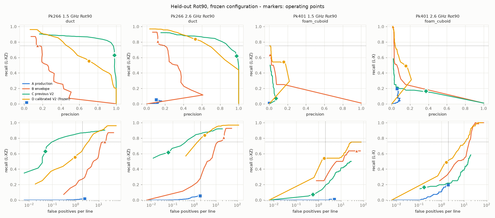
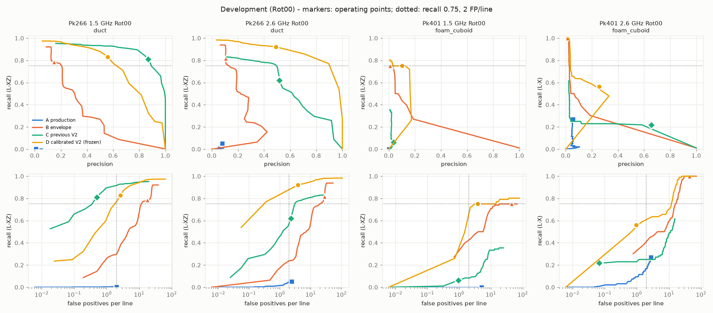

# Candidate V2 with calibrated physics, evaluated on held-out BAM Rot90

**Date:** 2026-10-05 · **Branch:** `research/candidate-v2-calibrated` (from `feat/known-geometry-depth-calibration`; the depth-calibration commits are untouched) · **Status:** EXPERIMENTAL (`benchmark.gates.CAPABILITY_STATUS["candidate_generation_v2_calibrated"]`). Production is unchanged, and there is no ML.

**Recommendation: `KEEP_EXPERIMENTAL`.**

## Summary

| | |
|---|---|
| Rot90 recall, frozen operating point | **0.61** macro (ducts 0.55 / 0.84, foam cuboids 0.54 / 0.49 at 1.5 / 2.6 GHz) |
| Rot90 false positives per line | **2.22** mean over all six scans, controls included (1.82 over the four target scans) |
| ≥ 0.75 recall with < 2 FP/line | **No.** No single scan meets both; the closest is Pk266 2.6 GHz with recall 0.84 at 3.0 FP/line. |
| vs production (Rot90) | Recall **0.61 vs 0.07** at fewer FP/line (2.22 vs 2.63). This is a clear improvement. |
| vs previous V2 (Rot90) | Better on foam cuboids (0.54 vs 0.07; 0.49 vs 0.17). **Worse on ducts**: same recall, but 4–50× more false positives, and its curve sits below the previous V2's. |
| Did calibrated velocity help? | **Modestly, not materially.** It helps on 1.5 GHz ducts and the empty control, and is neutral or negative elsewhere (§7). |
| Rot90 held-out status | **Clean for V2-cal design** (frozen at `25352a9` before any Rot90 scan was opened by this experiment). **Not pristine at repository level**: earlier, unrelated work examined Rot90 target-level numbers (§2). |



*Held-out Rot90 with the frozen configuration. Top row: recall vs precision. Bottom row: recall vs false positives per line (log scale). Markers are the frozen operating points: ■ production, ▲ envelope, ◆ previous V2, ● calibrated V2. Dotted lines mark recall 0.75 and 2 FP/line. Pk401 2.6 GHz is L-X only because its calibration was refused.*

## 1. Development set and baselines

**Development:** the six Rot00 scans, all previously examined:
- Pk266 at 1.5 and 2.6 GHz (ducts);
- Pk401 at 1.5 and 2.6 GHz (foam cuboids);
- Pk050 at 1.5 and 2.6 GHz (empty control).

Every design choice, threshold, grid and ablation used only these.

**Held-out:** the same six specimen × antenna combinations at Rot90.

**Archives:** Harvard Dataverse doi:10.7910/DVN/FCMUJQ (CC0). MD5s match the Dataverse record: Pk050 `433018325dc1…`, Pk266 `e43ea0991a1e…`, Pk401 `b5262d4ea98d…`. The archives are git-ignored.

**Scoring** is unchanged from the previous V2 (`scripts.bam_candidate_v2_experiment.score`, imported):
- **L-XZ:** within ±100 mm in x, the highest-ranked detection must lie within 60 mm of the drawn top depth, using the scan's own back-wall calibration. Other in-depth detections in the window are duplicates.
- **L-X:** used where calibration is refused (Pk401 2.6 GHz and Pk050 2.6 GHz, at both rotations). It is more permissive.

**Baselines were reproduced unchanged.** Development numbers at their frozen operating points:

| Rot00 scan | A production R / FP/line | B envelope R / FP/line | C previous V2 R / FP/line |
|---|---|---|---|
| Pk266 1.5 | 0.005 / 2.04 | 0.786 / 18.10 | 0.811 / 0.50 |
| Pk266 2.6 | 0.053 / 2.43 | 0.818 / 27.76 | 0.621 / 2.32 |
| Pk401 1.5 | 0.000 / 5.03 | 0.750 / 44.78 | 0.062 / 0.96 |
| Pk401 2.6 (L-X) | 0.271 / 2.77 | 1.000 / 43.84 | 0.219 / 0.07 |
| Pk050 1.5 (control) | – / 2.79 | – / 17.98 | – / 3.02 |
| Pk050 2.6 (control, L-X) | – / 1.70 | – / 21.61 | – / 2.82 |

- These are identical to `evidence/bam/results/candidate_v2.json`, except previous V2 on Pk266 2.6: 793 vs 794 detections, recall 0.621 vs 0.623. That is one detection's floating-point difference across library versions.
- The scorer's back-wall calibrations were recomputed from the scans and match the committed values exactly.
- Full baseline metrics (F1, duplicates, localisation and depth error) are in `evidence/bam/results/candidate_v2_calibrated/dev_baselines.json`.

## 2. Held-out integrity

**What this experiment did:**
- **Enforced in code.** `scripts/bam_v2cal_harness.py` refuses to open any Rot90 scan unless `configs/candidate_v2_calibrated_frozen.json` is committed and unmodified (tested in `tests/test_candidate_v2_calibrated.py`).
- **The protocol was committed before tuning.** `2d9086e` holds the pre-registered grid and selection rule. `bd00a81` is dev iteration 2. **`25352a9` is the freeze**, pushed before the first Rot90 scan was loaded.
- **The held-out run happened once.** Every held-out result records the freeze commit `25352a98d1409741d9176441ab5fc4ebc24d3749`. No parameter was changed afterwards.
- **One Rot90 check ran after the freeze and before scoring:** the registration check (§6). It is target-free and cannot change the detector.
- **Calibration inputs.** Rot90 calibration comes from each scan's back wall, using the existing rule. That rule uses drawn object positions only to *exclude* windows from the back-wall picks. The generator receives t0, v, the pick convention and the precision, and nothing else.

**What earlier, unrelated work had already done with Rot90 (found in the repository, recorded rather than hidden):**
1. `scripts/experiment_trace_span.py` chose a production post-filter K on Rot90 by target-level scoring (`docs/candidate-intelligence.md` §5). It selected K = 1, i.e. production unchanged.
2. `scripts/bam_quantitative_validation.py` produced Rot90 back-wall calibrations and known-position target depths. These sit in the committed `evidence/bam/results/quantitative_validation.json`.

This experiment never read either file's Rot90 target entries. Neither informed any V2-cal choice; I designed V2-cal in this session, and the previous V2 never used Rot90. **So Rot90 is held out with respect to V2-cal's design and parameters, but it is not a never-examined set at repository level.** In particular, the production arm's Rot90 behaviour had been seen before. The comparison is reported with that caveat.

## 3. What calibrated V2 is

The code is in `benchmark/candidate_v2_calibrated.py`. It is a high-recall proposal generator with separate, interpretable evidence. Its only hard gates are the proposal threshold and the lateral extent. Hyperbola shape is evidence, never a filter.

| Stage | What it does |
|---|---|
| A. Conditioning | Dewow; running-median background removal along x over W traces; Hilbert envelope; robust z-normalisation (`line` or `row`, chosen on dev). Direct-wave exclusion from t0 + 0.5 P, where t0 is the calibrated t0 or else the blind direct-wave time. A late-time noise floor per time row. Horizons (back walls, layers) from a 400 mm lateral median of the un-background-removed envelope; their endpoints mark step edges. |
| B. Proposals | Local envelope maxima above the threshold; lateral ridge extent; lateral background contrast; cross-line persistence. |
| C. Physics | **Calibrated:** depth d = v (t − t0) / 2, and the response curve t(x) = t0 + √((t_a − t0)² + (2·max(\|x−x_a\| − a, 0)/v)²) with v **fixed** by the calibration. a = 0 is a point or thin cylinder; a = 30 and 60 mm are flat-topped, void-like reflectors, so a void is not forced into a duct hyperbola. Sub-scores: fit; velocity consistency (the calibrated curve must beat a flat line and curves at 0.6 v and 1.6 v); symmetry; continuity. Depth plausibility: above the surface, minimum cover, and not below the most prominent horizon. **Uncalibrated:** v is searched over 0.08–0.16 m/ns, no depth is reported, and every proposal says `physics_basis: uncalibrated`. |
| D. Duplicates | Per-line NMS within ±50 mm and ±0.75 P; union-find clustering across lines. |
| E. Confidence | Evidence terms: `signal_strength`, `background_contrast`, `persistence`, `shape_consistency`, `depth_plausibility`. Penalties: `direct_wave_penalty`, `edge_penalty`, `structure_penalty`, `ringing_penalty`, `noise_penalty`. `final_score = mean(evidence) − 0.25 × Σ penalties`. The weights were fixed in advance. |

**When calibration is used.** The calibration is the product's known-geometry fit (`schemas.depth_calibration`: back-wall steps, peak convention, 0.1 ns precision). It is passed in only when that fit is `calibrated` **and** `redundant`, i.e. scientifically sufficient. Pk401 2.6 GHz and Pk050 2.6 GHz have no accepted back-wall selection at either rotation, so V2-cal ran **uncalibrated** there. It did not invent a calibration.

## 4. Development: tuning, the frozen configuration and ablations

**Pre-registered rule** (committed in `2d9086e` before the grid ran):
- Over all (proposal config, gate config, score threshold θ) combinations:
  - `macro_recall` = mean recall over the four Rot00 target scans;
  - `mean_fp` = mean FP/line over all six Rot00 scans, controls included.
- Among points with macro_recall ≥ 0.75, take the lowest mean_fp.
- Macro averaging gives each object type and antenna equal weight. Pooling would let 644 duct crossings per scan swamp the 100 cuboid crossings.

**Grid:** normalisation {line, row} × W {41, 81} × horizon ratio {1.5, 2.5} × threshold {3, 4, 6} × extent {0, 15, 30} mm × θ from −1.5 to 1.0 in steps of 0.01. A vectorised sweep checks exactly against `score`.

**Iterations**, both on Rot00 only and both judged by the same rule:

| Iteration | Change | Chosen | Dev macro R | Dev mean FP/line |
|---|---|---|---|---|
| 1 (`2d9086e`) | — | line, W41, h2.5, T4, extent 15 mm, θ 0.65 | 0.766 | **4.02** |
| 2 (`bd00a81`) | horizons must be flat over ≥ 300 mm; `row` dropped | line, W41, h1.5, T4, extent 15 mm, θ 0.63 | 0.758 | 5.78 |

- **Iteration 2 was motivated by a dev failure.** The 241 mm duct's broad apex was being treated as a horizon, and was then penalised as structure and as a step edge (64 missed crossings on Pk266 1.5 GHz).
- **Iteration 2 was rejected.** Max recall rose to 0.95–0.97, but losing horizons also lost the back-wall-residue suppression, and FP rose.
- **Iteration 1 is frozen** (`configs/candidate_v2_calibrated_frozen.json`; its module SHA-256 is recorded).
- **The < 2 FP/line target was already missed on development.** The threshold was not moved to hide this.

**Frozen V2-cal on development:**

| Rot00 scan | Recall | Precision | F1 | FP/line | Duplicates per hit | FP/line at R 0.75 (curve) | Max recall |
|---|---|---|---|---|---|---|---|
| Pk266 1.5 | 0.829 | 0.557 | 0.666 | 2.64 | 0.54 | 2.06 | 0.97 |
| Pk266 2.6 | 0.921 | 0.492 | 0.641 | 3.81 | 0.45 | 0.36 | 0.98 |
| Pk401 1.5 | 0.750 | 0.103 | 0.181 | 3.89 | 1.08 | 3.17 | 0.80 |
| Pk401 2.6 (L-X) | 0.562 | 0.257 | 0.353 | 0.97 | 0.13 | 12.2 | 1.00 |
| Pk050 1.5 (control) | – | – | – | 3.01 | – | – | – |
| Pk050 2.6 (control, uncalibrated) | – | – | – | **9.77** | – | – | – |



### Ablations on development

Each variant has its own θ, re-chosen on dev by the same rule (`ablations_refrozen_on_dev` in `dev_report.json`):

| Variant | Macro R | Mean FP/line | Change vs frozen |
|---|---|---|---|
| frozen | 0.766 | **4.02** | — |
| **calibration withheld** (uncalibrated everywhere) | 0.761 | 5.15 | +1.13 |
| without signal_strength | 0.760 | 6.31 | +2.29 |
| without background_contrast | 0.763 | 9.81 | **+5.79** |
| without persistence | 0.758 | 7.30 | +3.29 |
| without shape_consistency | 0.752 | 4.45 | +0.43 |
| without depth_plausibility | 0.756 | 6.10 | +2.09 |
| without direct_wave_penalty | 0.754 | 6.35 | +2.33 |
| without edge_penalty | 0.755 | 4.41 | +0.39 |
| without structure_penalty | 0.756 | 4.11 | +0.10 |
| without ringing_penalty | 0.772 | 6.86 | +2.85 |
| without noise_penalty | 0.752 | 5.61 | +1.59 |

- On development every term earns its place.
- Background contrast matters most, then persistence and ringing.
- Shape, edge and structure are small contributors.
- Withholding calibration costs +28% FP/line at matched recall.

## 5. Frozen parameters

| | |
|---|---|
| Commit containing the frozen configuration | **`25352a9`** (`configs/candidate_v2_calibrated_frozen.json`) |
| Proposal | normalisation `line`, background window 41 traces (205 mm), horizon ratio 2.5, proposal threshold z ≥ 4, lateral extent ≥ 15 mm |
| Operating point | `final_score` ≥ **0.65** |
| Module constants | All recorded in the config. Examples: shape tolerance 0.2 P; flat-top half-widths 0 / 30 / 60 mm; wrong-velocity factors 0.6 and 1.6; NMS ±50 mm × ±0.75 P; penalty weight 0.25 |
| Calibration input | Back-wall fit through `schemas.depth_calibration` (peak convention, 0.1 ns); used only when `calibrated` and `redundant` |
| Baselines | production z ≥ 3; envelope W81 global, T = 10; previous V2 frozen parameters with final_score ≥ 0.768 |

## 6. Rot90 registration check (target-free; after the freeze, before scoring)

The previous V2 skipped Rot90 because its grid mapping was "not established". I tested it with `scripts/bam_rot90_registration_check.py`:
- **Method:** correlate a depth-integrated conditioned-energy map of each Rot90 volume with its Rot00 counterpart, under four discrete hypotheses. No target or detection is read.
- **Result:** identity is best on all six pairs, with correlation 0.82–0.93.

**The x axis is established.** The x-mirror scores −0.37 to +0.03, and the back-wall orientation fit independently prefers as-drawn on every calibrated Rot90 scan.

**The y axis is only weakly established.** The y-mirror scores 0.78–0.91, which is 0.01–0.04 below identity, because the specimens are nearly symmetric in y. This matters only for the Pk401 cuboids, whose drawn y positions (398 / 498 mm) are asymmetric. Identity is used, and this is a recorded limit (`rot90_registration_check.json`).

## 7. Rot90 held-out evaluation (frozen, unchanged)

Results are at each arm's frozen operating point.
- "Dup" counts in-depth duplicates; "dup/hit" is duplicates per matched crossing.
- dx is the longitudinal error of matched detections (mean |dx|, mm). dz is the mean signed depth error (mm) of matched detections, where scoreable.
- Both errors are bounded by the ±100 mm and ±60 mm windows.

| Scan (type, antenna) | Arm | Recall | Precision | F1 | FP/line | FN | Dup (per hit) | Mean \|dx\| | dz | Max recall | FP/line at R 0.75 |
|---|---|---|---|---|---|---|---|---|---|---|---|
| **Pk266 duct 1.5 GHz** | production | 0.016 | 0.024 | 0.019 | 2.48 | 634 | 0 | 67.0 | −40.7 | 0.02 | – |
| | envelope | 0.755 | 0.144 | 0.242 | 17.97 | 158 | 41 (0.08) | 6.0 | +9.0 | 0.87 | 14.8 |
| | previous V2 | 0.630 | **0.981** | **0.767** | **0.05** | 238 | 0 | 4.9 | +8.9 | 0.90 | **0.19** |
| | **calibrated V2** | 0.553 | 0.702 | 0.619 | 0.94 | 288 | 549 (1.54) | 27.0 | +19.8 | **0.96** | 3.76 |
| **Pk266 duct 2.6 GHz** | production | 0.054 | 0.103 | 0.071 | 1.89 | 609 | 1 | 61.6 | −57.9 | 0.05 | – |
| | envelope | 0.809 | 0.121 | 0.211 | 23.40 | 123 | 35 (0.07) | 6.1 | +6.1 | 0.93 | 12.6 |
| | previous V2 | 0.618 | **0.975** | **0.757** | **0.06** | 246 | 56 (0.14) | 6.5 | +17.4 | 0.92 | **0.51** |
| | **calibrated V2** | **0.837** | 0.527 | 0.647 | 3.00 | 105 | 502 (0.93) | 6.5 | +5.6 | **0.97** | 2.30 |
| **Pk401 cuboid 1.5 GHz** | production | 0.010 | 0.001 | 0.002 | 4.95 | 95 | 0 | 95 | −9.6 | 0.01 | – |
| | envelope | **0.635** | 0.008 | 0.015 | 49.73 | 35 | 50 (0.82) | 8.4 | +29.0 | 0.64 | – |
| | previous V2 | 0.073 | 0.072 | 0.073 | **0.56** | 89 | 0 | 16.4 | +26.9 | 0.50 | – |
| | **calibrated V2** | 0.542 | **0.156** | **0.242** | 1.75 | 44 | 59 (1.14) | 42.0 | +33.7 | **0.75** | 28.5 |
| **Pk401 cuboid 2.6 GHz (L-X)** | production | 0.198 | 0.057 | 0.088 | 1.96 | 77 | 3 | 61.1 | n/s | 0.20 | – |
| | envelope | **1.000** | 0.014 | 0.028 | 40.89 | 0 | 358 (3.73) | 24.6 | n/s | 1.00 | 16.9 |
| | previous V2 | 0.167 | **0.372** | 0.230 | **0.17** | 80 | 15 (0.94) | 7.5 | n/s | 0.58 | – |
| | **calibrated V2 (uncalibrated mode)** | 0.490 | 0.154 | **0.234** | 1.61 | 49 | 15 (0.32) | 12.7 | n/s | **1.00** | **11.1** |
| **Pk050 control 1.5 GHz** | production | – | – | – | 2.91 | – | – | – | – | – | – |
| | envelope | – | – | – | 22.10 | – | – | – | – | – | – |
| | previous V2 | – | – | – | **1.58** | – | – | – | – | – | – |
| | calibrated V2 | – | – | – | 1.72 | – | – | – | – | – | – |
| **Pk050 control 2.6 GHz** | production | – | – | – | 1.58 | – | – | – | – | – | – |
| | envelope | – | – | – | 22.59 | – | – | – | – | – | – |
| | previous V2 | – | – | – | **0.84** | – | – | – | – | – | – |
| | calibrated V2 (uncalibrated mode) | – | – | – | 4.32 | – | – | – | – | – | – |

(n/s = not scoreable: calibration refused.)

**Macro summary** (mean of the four target scans for recall and precision; FP/line averaged over all six scans):

| Arm | Rot00 dev macro R | Rot00 mean FP/line | **Rot90 macro R** | **Rot90 mean FP/line** | Rot90 macro P |
|---|---|---|---|---|---|
| A production | 0.082 | 2.80 | 0.070 | 2.63 | 0.046 |
| B envelope | 0.839 | 29.0 | 0.800 | 29.5 | 0.072 |
| C previous V2 | 0.428 | 1.61 | 0.372 | **0.54** | **0.600** |
| **D calibrated V2** | 0.766 | 4.02 | **0.605** | 2.22 | 0.385 |

**Confidence distributions at the operating point** (final_score of retained detections; min / median / p90 / max):

| Scan | |
|---|---|
| Pk266 1.5 | 0.650 / 0.817 / 0.897 / 0.921 |
| Pk266 2.6 | 0.650 / 0.771 / 0.890 / 0.917 |
| Pk401 1.5 | 0.651 / 0.728 / 0.807 / 0.852 |
| Pk401 2.6 | 0.650 / 0.698 / 0.789 / 0.857 |
| Pk050 1.5 | 0.650 / 0.695 / 0.784 / 0.863 |
| Pk050 2.6 | 0.650 / 0.687 / 0.786 / 0.860 |

- Duct detections score clearly higher than control detections; the medians are 0.77–0.82 vs 0.69–0.70.
- Cuboid detections score barely above the control's. That is consistent with their low precision.

### Did calibration help on Rot90?

Each row compares the same frozen V2-cal with calibration withheld (reporting only; nothing was re-tuned). Format is recall / FP/line at θ 0.65, then FP/line at recall 0.75 from the curve.

| Scan | Calibrated | Calibration withheld |
|---|---|---|
| Pk266 1.5 | 0.55 / 0.94; **3.76** | 0.61 / 2.44; 5.89 |
| Pk266 2.6 | 0.84 / 3.00; 2.30 | 0.86 / 3.66; 2.35 |
| Pk401 1.5 | 0.54 / 1.75; 28.5 (max R 0.75) | 0.67 / 6.61; 20.6 (max R 0.78) |
| Pk050 1.5 (control) | **1.72** FP/line | 3.74 FP/line |

- Calibration halves the false positives on the 1.5 GHz control and improves the 1.5 GHz duct curve.
- It is neutral at 2.6 GHz.
- On the 1.5 GHz cuboids it trades recall for precision: the calibrated-velocity shape and depth terms favour compact scatterers.
- **It is a real but modest effect, not the step change** that would close the gap to the target.

### Held-out ablations (reporting only, at the frozen θ)

Full table: `heldout_report.json` → `v2_cal_ablations`.

| Term removed | Effect on Rot90 |
|---|---|
| **shape_consistency** | FP rises on Pk266 1.5 (0.94 → 2.29) and on the 1.5 GHz control (1.72 → 2.99). Pk401 1.5 max recall falls (0.75 → 0.69). Neutral on Pk266 2.6. **So shape helps, mostly through precision.** |
| **ringing_penalty** | Raises cuboid recall (0.54 → 0.62; 0.49 → 0.68) but multiplies FP 2–5×. On Pk266 1.5, FP/line at recall 0.75 goes 3.8 → 13.3. |
| **structure / edge penalties** | Removing them raises duct recall at the operating point (Pk266 1.5: 0.55 → 0.87), at 4.6 FP/line. This is the duct-apex-as-horizon problem seen on development, reproduced on held-out data (§8). |

## 8. Failure analysis (Rot90, calibrated V2)

### False positives (L-XZ; L-X where depth is not scoreable)

| Scan | Largest categories |
|---|---|
| Pk266 1.5 (151) | back wall / structural boundary 52; near a target, outside the match radius 41; edge-reinforcement rebar 26; wrong-depth response in a target window, below (ringing) 15; below the back wall 10; step edge 7 |
| Pk266 2.6 (483) | **wrong-depth response in a target window, below (ringing / internal multiple) 166**; rebar 88; step edge 85; near a target 72; below the back wall 51; back wall 18 |
| Pk401 1.5 (282) | **unknown 120**; rebar 50; near a target 45; step edge 40; back wall 23 |
| Pk401 2.6 (259, uncalibrated) | rebar 76; unknown 68; near a target 61; step edge 46; grouted borehole 7 |
| Pk050 1.5 (277) | unknown 149; rebar 99; below the back wall 24; back wall 5 |
| Pk050 2.6 (696, uncalibrated) | **unknown 392**; rebar 215; step edge 89 |

Notes on the categories:
- Direct-wave false positives were eliminated (production has 52–157 per scan).
- "Real non-target reflector" (edge rebar, boreholes) is a genuine response from something that is not a target.
- On the uncalibrated 2.6 GHz scans no back wall was found, so post-back-wall energy cannot be categorised and lands in "unknown". Pk050 2.6 is V2-cal's worst scan on both splits (9.8 and 4.3 FP/line).

### Missed target crossings

| Scan | Main causes |
|---|---|
| Pk266 1.5 (288) | duct-1 (241 mm): **penalised as a step edge 91**, as structure 30, as ringing 22. duct-2: as structure 58, as ringing 20, as a step edge 20 |
| Pk266 2.6 (105) | duct-1: as structure 33, as a step edge 11, depth gate 8, noise 7. duct-2: depth gate 9, ringing 9 |
| Pk401 1.5 (44) | cuboid-1: **penalised as ringing 19**, insufficient amplitude 5. cuboid-2: **ringing 20** |
| Pk401 2.6 (49) | cuboid-1: as structure 13, step edge 5, direct wave 4. cuboid-2: **direct wave 10**, step edge 7 |

- No miss is caused by preprocessing loss or a missing proposal on the ducts: the recall ceiling is 0.96–0.97.
- **The misses are ranking misses.** Penalties built to suppress clutter also fire on targets.

### Why foam / void targets failed in the previous V2, and what changed

**The previous V2 failed on cuboids because:**
1. its hard hyperbola filter rejected them;
2. its line-global threshold was 6;
3. NMS kept a wrong-depth response in the window.

On Rot90 it recovers 0.07 and 0.17 of cuboid crossings.

**V2-cal recovers 0.54 and 0.49 because:**
- it has **no hard shape filter**;
- its evidence is score-based;
- the structure and ringing penalties keep back-wall and late responses from outranking the cuboid.

**The flat-top shape model is not the main reason.**
- Among matched cuboid crossings, the point model still fits best in 36 of 52 and 44 of 47; the 60 mm flat-top model fits best in 15 and 3.
- The removal of point-diffractor assumptions as a *gate* is what mattered.

**The cuboid depth bias persists.** Matched cuboid detections sit +33.7 mm below the drawn top on Pk401 1.5 Rot90, against +29 mm for the envelope and previous V2 on Rot00. The strongest envelope is near the block's centre or base, not its top. This is unexplained and not corrected; cuboid depth stays EXPERIMENTAL.

**The remaining cuboid misses are new.** The ringing penalty fires on cuboid-1 and cuboid-2 because an earlier, stronger response sits directly above them. At 1.5 GHz that response comes within 4 periods (~4.6 ns, because of the frequency issue below). The response's identity is unknown: rebar or a borehole are possible.

## 9. Comparison with the previous V2

| | Previous V2 | Calibrated V2 |
|---|---|---|
| Ducts, Rot90 | **Better.** Recall 0.62–0.63 at 0.05–0.06 FP/line; 0.2–0.5 FP/line at recall 0.75 | More recall at the operating point on 2.6 GHz (0.84), but 1–3 FP/line and many in-depth duplicates; 2.3–3.8 FP/line at recall 0.75 |
| Foam cuboids, Rot90 | 0.07 / 0.17 recall | **0.54 / 0.49** recall at ~1.7 FP/line; recall ceiling 0.75 / 1.00 |
| Empty control, Rot90 | **0.84 – 1.58** FP/line | 1.72 / 4.32 FP/line (the uncalibrated 2.6 GHz scan is the weak point) |
| Macro, Rot90 | R 0.37, 0.54 FP/line, P 0.60 | **R 0.61**, 2.22 FP/line, P 0.39 |
| Recall ceiling (lowest threshold) | 0.90 / 0.92 / 0.50 / 0.58 | **0.96 / 0.97 / 0.75 / 1.00** |
| Proposals per line at the ceiling | 22–30 | 68–134 |

Neither generator dominates:
- V2-cal is the better **high-recall proposal set**: its ceiling is ≥ 0.75 on every target scan.
- The previous V2 is the better **duct detector**.

## 10. Decision

| Promotion condition | Met? |
|---|---|
| Clear held-out improvement over production | **Yes.** Macro recall 0.61 vs 0.07 at lower FP/line (2.22 vs 2.63); F1 0.47 vs 0.06 |
| Recall useful for downstream interpretation | **Partly.** 0.49–0.84 per scan at the operating point; ceilings 0.75–0.97 |
| False-positive volume manageable | **Not yet.** 2.2 FP/line on average and 4.3 on an empty specimen; in-depth duplicates up to 1.5 per hit |
| Not confined to one object type or antenna | **Yes.** Both types sit around 0.5–0.8 and both antennas work. The weakest condition is an *uncalibrated* 2.6 GHz scan. |
| No target ground truth used by the generator | **Yes.** Truth-blind by test. Drawings enter only through the back-wall calibration (fabricated thicknesses; drawn objects used only to exclude windows). |

**Recommendation: `KEEP_EXPERIMENTAL`.**
- **Not shadow mode.** The pre-stated target (≥ 0.75 recall, < 2 FP/line) is missed on held-out data. FP volume on an empty specimen is not manageable at 2.6 GHz. On ducts it is dominated by the previous V2.
- **Not redesign or abandon.** It is the first generator here whose held-out recall ceiling is ≥ 0.75 on both object types at manageable proposal volume. Its failure modes are specific, named and fixable in a V3 (§11).
- Production is not replaced. `candidate_generation` stays FAILED, and nothing is VALIDATED.

## 11. Ideas for Candidate V3 (from Rot90; deliberately NOT applied to V2)

1. **Absorb hyperbola-arm duplicates with the calibrated curve.** On Pk266 1.5 Rot90 there are 1.54 in-depth duplicates per hit and mean |dx| 27 mm. Arm responses ±50–100 mm from the apex survive NMS and sometimes outrank the apex. With v known, any response lying on a stronger response's predicted curve can be merged into it.
2. **Fix the dominant-frequency estimate.** The blind estimate (mean spectrum from t0 + 1 ns) gave **0.84 GHz for a 2.6 GHz antenna** on Pk401 Rot90, and 0.94 vs 1.33 GHz for the 1.5 GHz antenna across rotations. Late-time attenuation biases it low, so every period-scaled tolerance and the ringing window are too wide. Use the early-time direct-wave spectrum, or the declared antenna frequency.
3. **Horizon vs deep compact scatterer.** Iteration 2's flat-run rule recovered the deep duct but lost back-wall suppression. V3 needs both: horizons must be flat and long, *plus* explicit back-wall suppression from the calibration reflectors' own times. Those times are known exactly when the calibration is declared.
4. **Ringing penalty.** Fire it only when the earlier response is the **same** reflector, e.g. the same lateral footprint and shape, not just anything stronger above.
5. **Uncalibrated scans.** At 2.6 GHz without calibration, V2-cal has no reliable back-wall time, and the empty control produces 4–10 FP/line. Either refuse candidate generation without a sufficient calibration, or carry a much stricter uncalibrated operating point.
6. **Score transfer.** The single θ transfers imperfectly across rotations: Pk266 1.5 recall is 0.83 on dev vs 0.55 on held-out at the same θ. Consider per-scan rank- or quantile-based operating points.

## 12. Answers

1. **Did calibrated velocity materially improve candidate generation?**
   - **Modestly, not materially.** On development, withholding calibration raises FP/line from 4.0 to 5.2 at matched recall.
   - On Rot90 it halves FP on the 1.5 GHz control (3.7 → 1.7) and improves the 1.5 GHz duct curve (5.9 → 3.8 FP/line at recall 0.75).
   - It is neutral at 2.6 GHz and lowers cuboid recall at the operating point.
   - Most of the gain over the previous V2 on cuboids comes from the architecture (no hard shape gate, structure and ringing evidence), not from the velocity.
2. **What is recall on Rot90?** **0.605 macro** at the frozen operating point:
   - ducts 0.553 (1.5 GHz) and 0.837 (2.6 GHz), L-XZ;
   - foam cuboids 0.542 (1.5 GHz, L-XZ) and 0.490 (2.6 GHz, L-X).
3. **What are false positives per line?** **2.22** mean over the six Rot90 scans:
   - target scans: 0.94, 3.00, 1.75, 1.61;
   - empty controls: 1.72 and 4.32.
4. **Is ≥ 0.75 recall with < 2 FP/line achieved?** **No**, neither macro (0.61 / 2.22) nor on any single scan.
5. **Does performance hold for both antennas?**
   - Recall, yes: 0.55 / 0.54 at 1.5 GHz, 0.84 / 0.49 at 2.6 GHz.
   - FP, no: the 2.6 GHz scans carry the most FP (3.0 on ducts, 4.3 on the uncalibrated control).
6. **Does it hold for both ducts and void/foam targets?**
   - **Recall: roughly yes** (0.49–0.84). This is the first generator here to do so at < 2 FP/line on the cuboid scans.
   - **Quality: no.** Cuboid precision is 0.15, against 0.53–0.70 on ducts. On ducts the previous V2 is clearly better.
7. **Is hyperbola scoring helping overall?**
   - **Yes, modestly, as evidence.** Removing shape_consistency raises dev FP/line 4.0 → 4.5 at matched recall. On Rot90 it raises FP on the 1.5 GHz duct and control scans by ×1.7–2.4, and lowers the 1.5 GHz cuboid recall ceiling (0.75 → 0.69).
   - The calibrated curve beats wrong velocities, but most cuboids still match a point model best. As a hard filter (previous V2) it was the main cause of cuboid misses.
8. **Is the proposal set now good enough for an AI classifier?**
   - **Closer, but not yet.** Its held-out recall ceiling is 0.96 / 0.97 / 0.75 / 1.00, so a downstream classifier could reach ≥ 0.75 recall on every target scan, which the previous V2 could not (ceiling 0.50 on Pk401 1.5).
   - But at that ceiling there are 68–134 proposals per line, with many arm duplicates.
   - Fix V3 items 1–2 (duplicates, frequency) first. Then the pre-threshold V2-cal set, with its component scores as features, is the right input for a classifier.
   - Training would need far more than 3 specimens.
9. **Shadow mode or research-only?** **Research-only (`KEEP_EXPERIMENTAL`).** Do not replace production, and do not put it in shadow mode yet.

## 13. Limits

- Three concrete specimens, four targets each, two antennas.
- Recall counts line crossings, not objects. Rot90 is a second acquisition of the **same** specimens, not new objects.
- Rot90 is held out from V2-cal's design but not pristine at repository level (§2). The y registration is only weakly established (§6).
- Depth scoring is unavailable on the 2.6 GHz Pk401 and Pk050 scans (calibration refused); L-X is more permissive.
- Development already missed the target, and the dev set was used for two iterations. The held-out drop for ducts at 1.5 GHz (0.83 → 0.55 recall at the same θ) shows the score scale does not transfer cleanly.

## Reproduce

```
python -m scripts.bam_candidate_v2_calibrated --phase baselines   # Rot00 baselines A-C
python -m scripts.bam_candidate_v2_calibrated --phase grid        # Rot00 grid + pre-registered selection
python -m scripts.bam_candidate_v2_calibrated --phase freeze      # writes the frozen config (then commit it)
python -m scripts.bam_candidate_v2_calibrated --phase dev_report  # Rot00 full metrics + re-frozen ablations
python -m scripts.bam_rot90_registration_check --out evidence/bam/results/candidate_v2_calibrated/rot90_registration_check.json
python -m scripts.bam_candidate_v2_calibrated --phase heldout     # Rot90; refuses unless the frozen config is committed
python -m scripts.plot_candidate_v2_calibrated
```

- Inputs: the three BAM archives in `datasets/raw/bam_concrete/` (git-ignored).
- Results: `evidence/bam/results/candidate_v2_calibrated/` (`dev_baselines.json`, `dev_grid_iteration{1,2}.json`, `dev_report.json`, `heldout_report.json`, `rot90_registration_check.json`).
- Runtime: CPU only, about 2 minutes per scan per proposal configuration.
